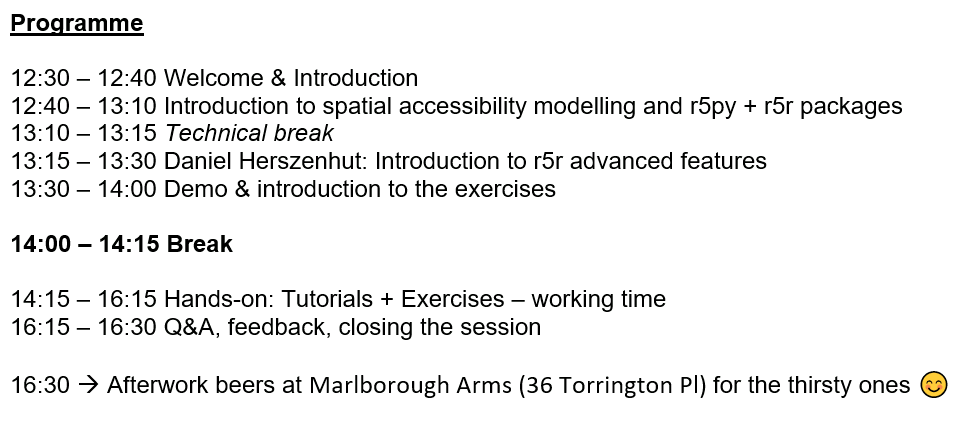

.. figure:: img/Sustainable_mobility_banner.png

*Workshop*: **Open tools for large-scale spatial accessibility analysis in Python and R** deals with the use open-source tools in Python (r5py) and R (r5r) to study spatial
accessibility in urban environments.

After participating in the event:

- you understand the basic workflow and data requirements for analysing spatial accessibility
- you can use open-source libraries in Python (or R) to calculate travel time matrices by different travel modes (walking, cycling, transit, car)
- you understand the possibilities and limitations of the demonstrated tools

Course format
-------------

The majority of this event will be spent in front of a computer writing code with the Python (or R) language.
Most exercises in this course involve real world examples and data.

.. admonition:: Interactive contents

    Each tutorial in this course can be turned into an interactive programming session in the browser.
    You can find buttons for activating the python environment using `Binder <https://mybinder.readthedocs.io/en/latest/>`__ at the top of each programming lesson.

Program
-------

The planned schedule for the event:

Contents
--------

.. toctree::
   :maxdepth: 1
   :caption: Basic information

   course-info/introduction
   course-info/installing-miniconda
   course-info/literature
   course-info/License-terms
   course-info/attribution

.. toctree::
   :maxdepth: 1
   :caption: Presentations

   .. lessons/giscience-and-sustainable-mobility

.. toctree::
   :maxdepth: 1
   :caption: Tutorials

   notebooks/r5py_intro.ipynb
   notebooks/r5r_intro.ipynb

.. toctree::
   :maxdepth: 1
   :caption: Extra materials

   lessons/giscience-and-sustainable-mobility
   lessons/git-basics
   notebooks/intro-to-python-geostack.ipynb
   notebooks/popgrid_to_points.ipynb
   notebooks/download_poi_data_for_Brighton.ipynb
   notebooks/download_elevation_data_python.ipynb

.. toctree::
   :maxdepth: 1
   :caption: Exercises

   exercises/exercise-1

